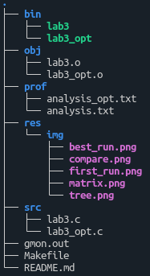
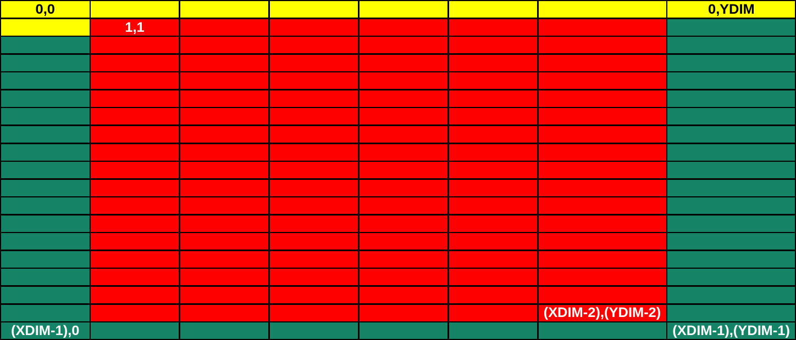
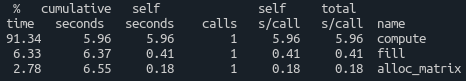
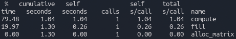
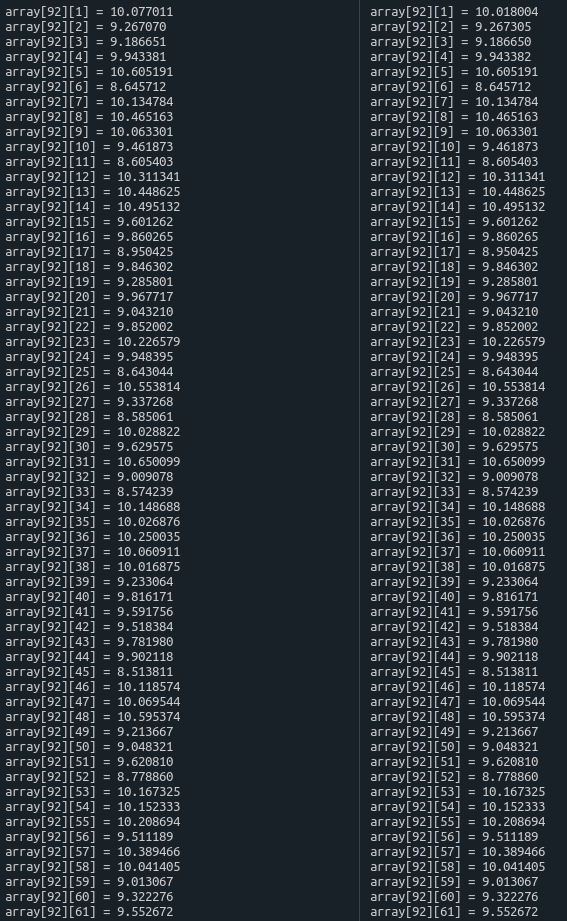

# Laboratorio Nº3 - Code optimizations
### Sistemas Operativos II - FCEFyN - UNC
## Introduction
El presente es un trabajo práctico de laboratorio cuyo objetivo es el de analizar un programa dado, y aplicarle cambios que tengan impacto en la velocidad de ejecución del mismo, tratando de mejorar tanto como se pueda la performance y disminuir el consumo de recursos del sistema.

## Startup
Para comenzar, se debe clonar el repositorio. Una vez hecho, podemos compilar todo el proyecto aprovechando el archivo makefile, con el comando:

`make all`

o, simplemente:

`make`

Esto compilará todo con las flags indicadas en la consigna:

`-Wall -pedantic -Werror -Wextra -Wconversion -std=gnu11`

Para asegurarnos de que el compilador no intervendrá realizando ninguna optimización, se agrega la flag `-O0`, y para poder realizar análisis de profiling con la herramienta `gprof` se agrega la flag `-pg`.

Se organizó el proyecto en distintas carpetas para un mejor manejo de archivos. El código fuente en lenguaje C que engloba la resolución del trabajo se encuentra en la carpeta `src`. Se crean carpetas adicionales para los archivos `.o` y para los binarios ejecutables finales. El resultado del análisis de profiling en texto legible se halla en la carpeta `prof` bajo el nombre `analysis`, en formato `.txt`.

A continuación se proporciona una vista general de la organización de los archivos del proyecto, asumiendo la correcta compilación y ejecución, con el resultado del análisis de profiling:

\
*Figura 1: Esquema de la organización del proyecto*

## Development

El código inicial consta de las siguiente funciones:
- `alloc_matrix`
- `fill`
- `compute`
- `print`
- `main`

Ninguna función fue removida ni añadida.

A continuación se detallan los cambios realizados fuera de las funciones listadas:

- Se eliminaron bibliotecas innecesarias como `<time.h>` y `<math.h>`.
- En lugar de declarar a `XDIM` y  `YDIM` como variables globales, se las definió para que el procesador resuelva su valor en tiempo de compilación, y así ahorrar tiempo de ejecución.
- En lugar de calcular el valor de un puntero de tipo `double` para las funciones que lo requieran, se definió la macro `PTR_SIZE` que calcula dicho valor. Esto generalmente aporta mejoras en la velocidad de ejecución.

A continuación se detallan los cambios realizados en las funciones:

### main
- La variable `i` se eliminó por no ser utilizada.
- Se redujo el scope de la matriz `kern`, trasladándola a la función `compute`, ya que sólo se la utiliza allí.
- En lugar de declarar y luego alocar mediante `alloc_matrix` el arreglo `arr`, se hizo todo en una sola línea.

### print
- Las variables `i` y `j` fueron declaradas como `register` para que el compilador las almacene en registros del CPU en lugar de en la memoria, con el objetivo de poder acceder a ellas más rápidamente dado que se utilizan en bucles.
- Las variables `i` y `j` fueron declaradas como `unsigned short int`, para reducir tanto como se pueda el uso de memoria en estas dos variables que simplemente van de 0 a `XDIM` y `YDIM` (ambos 10000 en este caso). Utilizar, por ejemplo, `int` sería un gasto de memoria innecesario. De esta manera cada variable en lugar de ocupar 4 bytes, ahora ocupa 2 bytes.
- Las variables `i` y `j` fueron declaradas antes de los bucles para evitar tener que declarar aquella del bucle interno cada vez que el bucle externo termina una iteración.
- Se utilizó aritmética de punteros para acceder a los elementos del arreglo, lo cual tiene un costo computacional menor que calcular la posición vía índices.

### alloc_matrix
- Originalmente, esta función reserva memoria con `malloc` de manera dinámica para el arreglo, luego la escribe con `memset` y retorna el puntero al arreglo.
- Como la escritura de la memoria es innecesaria ya que la función `fill` se encarga de escribir el arreglo, se optó por eliminar este proceso con `memset`, ganando mucho tiempo en la ejecución de la función.
- Dado que no se escribe en memoria, fue posible deshacerse de las variables `j` y `k`.
- La variable `i` del bucle se declaró como `register unsigned short int` por las mismas razones mencionadas anteriormente.
- Se reemplazó el bucle `for` por un bucle `while`.
- Se utilizó aritmética de punteros para acceder a los elementos del arreglo, lo cual tiene un costo computacional menor que calcular la posición vía índices.
- En lugar de calcular el tamaño de una variable de tipo `double` cada vez que se lo requiere dentro de `malloc` en el bucle, se optó por multiplicar por su valor conocido, que no depende de la arquitectura del procesador.
- En lugar de multiplicar `YDIM` por 8 (el tamaño de una variable de tipo `double`), se aprovechó que 8 es potencia de 2 (2³ = 8), y se optó por aplicar un shift de 3 posiciones a la izquierda, lo cual es equivalente a multiplicar por 2³, ya que un shift es más rápido y económico que una multiplicación.

### fill
- Esta función se encarga de llenar con datos aleatorios la matriz. Estos datos están acotados al rango [0, 100), que es igual a [0, 99].
- Para agilizar los loops `for`, se los reemplazó por ciclos `while` invertidos (en lugar de crecer de 0 a LIM-1, decrecen de LIM-1 a 0).
- Las variables `i` y `j` de los loops `while` se declararon como `register unsigned short int` por las mismas razones mencionadas anteriormente, reduciendo su scope tanto como se pudo.
- Se optó por no utilizar una seed vía `srand` para la función `rand`, ahorrando una llamada a una función y, de acuerdo a `man rand`, si no se proporciona una seed, la misma se configura por defecto a 1. Para respetar la secuencia aleatoria entre la versión optimizada y la original, a la original también se le eliminó el llamado a `srand`.
- Se utilizó aritmética de punteros para acceder a los elementos del arreglo, lo cual tiene un costo computacional menor que calcular la posición vía índices.

### compute
- Primero, se debe comprender qué se realiza en esta función. El objetivo en `compute` es el de establecer en ciertos lugares de la matriz unos valores calculados en base a ciertos parámetros. Más concretamente, se busca llenar la matriz como se ve en la siguiente figura:
\
*Figura 2: Descripción gráfica de las zonas de la matriz afectadas por la función `compute`*
  - La zona amarilla quedará con un valor basura con el que se inicializa una variable acumulativa.
  - La zona roja tendrá un nuevo valor acumulativo calculado.
  - La zona verde debe almacenar el último valor acumulativo calculado.
- Se comenzó por declarar e inicializar dentro de esta función la matriz `kern` de tipo `__int8_t`, que fue quitada de la función `main` con el objetivo de reducir su scope tanto como se pueda y reducir la memoria ocupada por cada uno de sus elementos (se la tuvo que quitar de los parámetros esperados por la función).
- Se optó por evitar cálculos innecesarios intermedios, por lo que se eliminaron las variables `dato`, `x` y `y`.
- El mayor cuello de botella detectado en esta función es el condicional `if`, los cuatro bucles `for` dentro del mismo y los cálculos intermedios. Como criterio para evitar los saltos, los cálculos y las repeticiones redundantes, se optó por sólo trabajar con la *zona roja* de la matriz, indicada en la figura 2. De esta manera, el contorno de la matriz quedará con el valor aleatorio asignado en la función `fill` y la zona roja obtendrá el valor calculado, que es de mayor importancia. De esta manera, nos estamos ahorrando `2*(YDIM + XDIM - 2)` iteraciones.
    - Como justificación para este criterio, se tomó lo mencionado en la presentación del trabajo práctico: este algoritmo puede aplicarse a procesamiento de imágenes. De esta manera, evitando recorrer los "bordes" de la matriz, la pérdida de información se hace insignificante mientras mayor sea la matriz (imagen) a procesar.
- Teniendo en cuenta el criterio adoptado, se eliminaron las variables `k` y `l`.
- Las variables `i` y `j` de los loops `for` se declararon como `register unsigned short int` por las mismas razones mencionadas anteriormente.
- Se borró la instrucción `printf`, que no aporta nada significante y ralentiza muchísimo la función.
- Como ahora estamos trabajando en la "zona de interés", se pudo prescindir del condicional `if`.
- Para evitar el overhead que implica recorrer los loops `for` internos que en total suman sólo 9 iteraciones, se optó por desglosar los loops `for` en instrucciones individuales, reemplazando cuidadosamente los valores correspondientes a las variables `k` y `l` ya inexistentes. Como la variable `accum` se utilizaba para cálculos intermedios entre iteraciones (simplemente acumular lo calculado hasta el momento), ahora que no contamos con loops `for` podemos prescindir completamente de ella y realizar una suma de todos los elementos de la matriz `tmp_sum` en la misma línea de asignación del `ij`-ésimo elemento de la matriz.

## Screenshots

Como prueba de que las optimizaciones dieron resultado, a continuación vemos una comparativa entre la primera corrida del programa sin optimizar, y la mejor corrida del programa optimizado:

\
*Figura 3: Resultado de la primera corrida del programa, sin ninguna optimización*

\
*Figura 4: Resultado de la mejor corrida del programa,  con todas las optimizaciones listadas*

De esta manera podemos obtener, mediante una simple *regla de 3*, que la velocidad de ejecución del programa optimizado resultó en una mejora del `80.1527%`.

Como prueba de que la optimización es funcional, a continuación se presenta una comparativa entre el resultado de la versión sin optimizar y la versión optimizada, reduciendo el tamaño de la matriz a `100x100` por practicidad:

\
*Figura 5: Comparación de resultados entre la versión original y la versión optimizada*

Observando los resultados, podemos apreciar que sólo algunos datos calculados presentan una diferencia mínima que puede considerarse despreciable (aunque esto último depende fuertemente de la aplicación).

## Remarks
A pesar de ser más veloz de acuerdo a múltiples fuentes, al menos teóricamente en ciertos escenarios, el uso de aritmética de punteros en lugar de índices no siempre favoreció la velocidad de ejecución. Sólo se la aplicó donde se observaron cambios significativos.